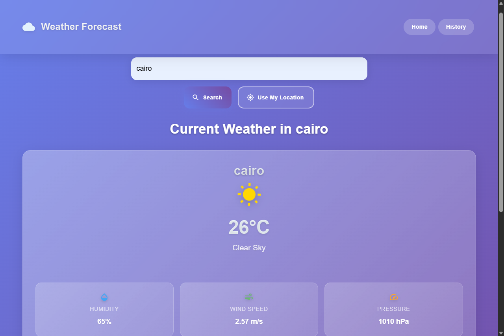

# Weather Forecasting Web Application



## 🌟 Overview

This Weather Forecasting Web Application is a comprehensive, full-stack solution designed to provide users with real-time weather updates, accurate 5-day forecasts, and a historical record of their past weather searches. Built with a modern technology stack, it offers a seamless and intuitive user experience, allowing individuals to effortlessly track weather conditions for any city worldwide or their current location.

The application emphasizes a clean, responsive design, ensuring optimal usability across various devices, from desktops to mobile phones. Its robust backend handles data fetching and persistence, while the interactive frontend presents information clearly and engagingly. This project serves as a practical demonstration of integrating real-time API data, managing state in a React application, and building a RESTful API with Node.js and Express.js, backed by a MongoDB database.

**Website URL : https://momenkelany.github.io/weather-app/ **
**Backend URL : https://backend-silent-wind-3827.fly.dev **
## ✨ Features

- **Real-time Weather Updates**: Get instant, up-to-the-minute weather conditions for any specified city, including temperature, humidity, wind speed, and atmospheric pressure.
- **5-Day Weather Forecast**: Plan ahead with a detailed 5-day forecast, providing insights into upcoming weather patterns.
- **Search by City Name**: Easily find weather information for any city by typing its name into the intuitive search bar.
- **Current Location Weather**: Utilize the HTML5 Geolocation API to automatically detect and display weather conditions for your current geographical position.
- **Search History**: All your past weather searches are automatically saved and accessible, allowing you to quickly revisit previously viewed locations.
- **Detailed Weather Metrics**: Access comprehensive weather data, including:
    - Temperature (Celsius)
    - Humidity (%)
    - Wind Speed (m/s)
    - Atmospheric Pressure (hPa)
- **Responsive Design**: The application is fully responsive, providing an optimal viewing and interaction experience across a wide range of devices and screen sizes.
- **Modern UI/UX**: Features a visually appealing interface with a glassmorphism design, smooth animations, and intuitive navigation.

## 🚀 Technologies Used

This application leverages a robust and modern technology stack to deliver its features:

### Frontend
- **ReactJS**: A powerful JavaScript library for building user interfaces, providing a component-based architecture for efficient and scalable development.
- **Material-UI (MUI)**: A popular React UI framework that implements Google's Material Design, offering a comprehensive suite of pre-built, customizable UI components.
- **React Router DOM**: For declarative routing within the React application, enabling seamless navigation between different views.
- **CSS3**: Custom styling with advanced features like Flexbox, Grid, and responsive media queries to ensure a visually appealing and adaptive design.

### Backend
- **Node.js**: A JavaScript runtime built on Chrome's V8 JavaScript engine, used for building scalable network applications.
- **Express.js**: A fast, unopinionated, minimalist web framework for Node.js, used for building the RESTful API.
- **Mongoose**: An elegant MongoDB object modeling tool designed to work in an asynchronous environment, providing a straightforward way to interact with MongoDB.

### Database
- **MongoDB**: A NoSQL, document-oriented database used for storing search history data, offering flexibility and scalability.

### APIs
- **OpenWeatherMap API**: Provides access to current weather data and 5-day forecasts for various locations.
- **HTML5 Geolocation API**: Used to obtain the user's current geographical coordinates for location-based weather lookups.

### Deployment
- **GitHub Pages**: For hosting the frontend application, enabling easy deployment and accessibility.

## ⚙️ Setup and Installation

To get this project up and running on your local machine, follow these steps:

### Prerequisites
Before you begin, ensure you have the following installed:
- **Node.js**: Version 14 or higher. You can download it from [nodejs.org](https://nodejs.org/).
- **MongoDB**: Ensure you have a running MongoDB instance (local or cloud-based like MongoDB Atlas). You can download MongoDB Community Server from [mongodb.com](https://www.mongodb.com/try/download/community).
- **OpenWeatherMap API Key**: Obtain a free API key from the [OpenWeatherMap website](https://openweathermap.org/api). This key is essential for fetching weather data.

### Installation Steps

1. **Clone the Repository**:
   First, clone the project repository to your local machine using Git:
   ```bash
   git clone https://github.com/your-username/weather-app.git
   cd weather-app
   ```
   *(Replace `your-username` with the actual GitHub username or organization name if this project is hosted on GitHub.)*

2. **Install Backend Dependencies**:
   Navigate into the `backend` directory and install the necessary Node.js packages:
   ```bash
   cd backend
   npm install
   ```

3. **Install Frontend Dependencies**:
   Return to the root directory of the project, then navigate into the `frontend` directory and install its dependencies:
   ```bash
   cd ../frontend
   npm install
   ```

4. **Configure Environment Variables**:
   Create a `.env` file in the `backend` directory (at `weather-app/backend/.env`) and add the following environment variables. Replace the placeholder values with your actual MongoDB URI and OpenWeatherMap API key:
   ```
   MONGODB_URI=your_mongodb_connection_string
   OPENWEATHER_API_KEY=your_openweather_api_key
   PORT=5000
   ```
   *Example `MONGODB_URI` for a local MongoDB instance: `mongodb://localhost:27017/weather_app`*
   *For MongoDB Atlas, use the connection string provided in your Atlas cluster.*

   Additionally, create a `.env` file in the `frontend` directory (at `weather-app/frontend/.env`) for the frontend's API key. This is primarily for the fallback geolocation, as the main weather data is fetched via the backend:
   ```
   REACT_APP_OPENWEATHER_API_KEY=your_openweather_api_key
   ```

## 🚀 Running the Application

To start both the backend server and the frontend development server, follow these steps:

1. **Start the Backend Server**:
   Open a new terminal window, navigate to the `backend` directory, and start the server:
   ```bash
   cd backend
   npm start
   ```
   The backend server will typically run on `http://localhost:5000` (or the `PORT` you specified in `.env`).

2. **Start the Frontend Development Server**:
   Open another new terminal window, navigate to the `frontend` directory, and start the React development server:
   ```bash
   cd ../frontend
   npm start
   ```
   The frontend application will open in your default web browser at `http://localhost:3000`.

## 📂 Project Structure

The project is organized into `frontend` and `backend` directories, each with its own specific responsibilities:

```
weather-app/
├── backend/                      # Node.js + Express.js RESTful API
│   ├── controllers/              # Business logic for API endpoints
│   │   ├── searchHistoryController.js  # Handles search history operations
│   │   └── weatherController.js        # Fetches weather data and forecast
│   ├── models/                   # Mongoose schemas for MongoDB
│   │   └── SearchHistory.js            # Defines the SearchHistory data model
│   ├── routes/                   # API route definitions
│   │   ├── searchHistoryRoutes.js      # Routes for search history
│   │   └── weatherRoutes.js            # Routes for weather data
│   ├── .env                      # Environment variables for backend
│   ├── package.json              # Backend dependencies and scripts
│   ├── server.js                 # Main Express server application
│   └── ...                       # Other backend related files
│
├── frontend/                     # ReactJS single-page application
│   ├── public/                   # Static assets (HTML, favicon, images)
│   │   ├── index.html                # Main HTML file
│   │   ├── cloud_favicon.png         # Custom favicon for the app
│   │   └── ...                       # Other static assets
│   ├── src/                      # React source code
│   │   ├── components/           # Reusable UI components
│   │   │   ├── Navbar.js
│   │   │   ├── SearchBox.js
│   │   │   ├── WeatherCard.js
│   │   │   └── ...
│   │   ├── pages/                # Page-level components (views)
│   │   │   ├── Home.js
│   │   │   ├── Forecast.js
│   │   │   ├── History.js
│   │   │   └── StyleTest.js
│   │   ├── styles/               # Global and component-specific CSS
│   │   │   ├── App.css
│   │   │   └── ...
│   │   ├── App.js                # Main application component
│   │   ├── index.js              # Entry point for React app
│   │   └── ...                   # Other frontend related files
│   ├── .env                      # Environment variables for frontend
│   ├── package.json              # Frontend dependencies and scripts
│   └── ...                       # Other frontend related files
│
└── README.md                     # This documentation file
```

## 🌐 Deployment

This application is configured for easy deployment, particularly the frontend to **GitHub Pages**, and backend to **https://fly.io/**

### Frontend Deployment to GitHub Pages

1. **Install `gh-pages`**: If you haven't already, install the `gh-pages` package in your `frontend` directory:
   ```bash
   cd frontend
   npm install --save-dev gh-pages
   ```

2. **Configure `package.json`**: Ensure your `frontend/package.json` has the following scripts and no `homepage` field (as it's removed for local development, but `gh-pages` will add it during deployment):
   ```json
   {
     "name": "frontend",
     "version": "0.1.0",
     "private": true,
     "dependencies": {
       // ... your dependencies
     },
     "scripts": {
       "start": "react-scripts start",
       "build": "react-scripts build",
       "test": "react-scripts test",
       "eject": "react-scripts eject",
       "predeploy": "npm run build",
       "deploy": "gh-pages -d build"
     },
     // ... rest of your package.json
   }
   ```

3. **Create a GitHub Repository**: Create a new public repository on GitHub (e.g., `weather-app`).

4. **Push Your Code**: Push your local `weather-app` project to this new GitHub repository.

5. **Deploy**: From your `frontend` directory, run the deploy script:
   ```bash
   cd frontend
   npm run deploy
   ```
   This command will build your React application and push the `build` folder content to a `gh-pages` branch in your GitHub repository. GitHub Pages will then serve your application from this branch.

6. **Access Your Deployed App**: Once deployed, your application will be accessible at `https://your-username.github.io/your-repository-name/` (e.g., `https://momenkelany.github.io/weather-app/`). It might take a few minutes for GitHub Pages to update.

### Backend Deployment

The backend (Node.js/Express.js) is deployed to **https://fly.io/** cloud platform. Ensure your `MONGODB_URI` and `OPENWEATHER_API_KEY` environment variables are correctly configured on your chosen hosting platform.
1. **Install `fly.io`** using this command
  ```b iwr https://fly.io/install.ps1 -useb | iex
   ```
   2. **deploy** using this command
    ```fly deploy
   ```
## 🤝 Contributing

Contributions are welcome! If you have suggestions for improvements, bug fixes, or new features, please feel free to:

1. Fork the repository.
2. Create a new branch (`git checkout -b feature/YourFeatureName`).
3. Make your changes.
4. Commit your changes (`git commit -m 'Add YourFeatureName'`).
5. Push to the branch (`git push origin feature/YourFeatureName`).
6. Open a Pull Request.

## 📄 License

This project is licensed under the MIT License. See LICENSE file for details.

## 📞 Contact

For questions or support, please contact:

Phone: +201152214242
Email: momenkelany1@gmail.com
LinkedIn: https://www.linkedin.com/in/momen-kelany
GitHub: https://github.com/momenkelany

---

*Last updated: July 2025*


